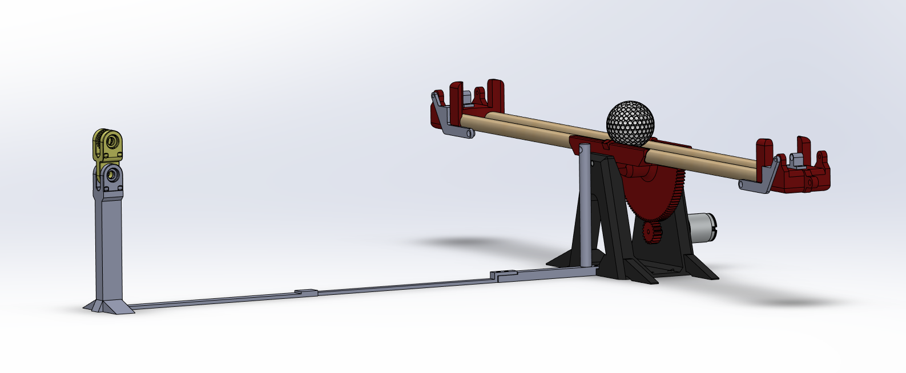

# BALANCE Control System

The BALANCE system is a visual servoing control system which positions a ball on a ball and beam control system. This implementation uses MATLAB and a Raspberry PI to control and DC motor with a feedback signal from a raspberry pi CAM.
  

The complete system is described in detail in the documentation located in this repository.
