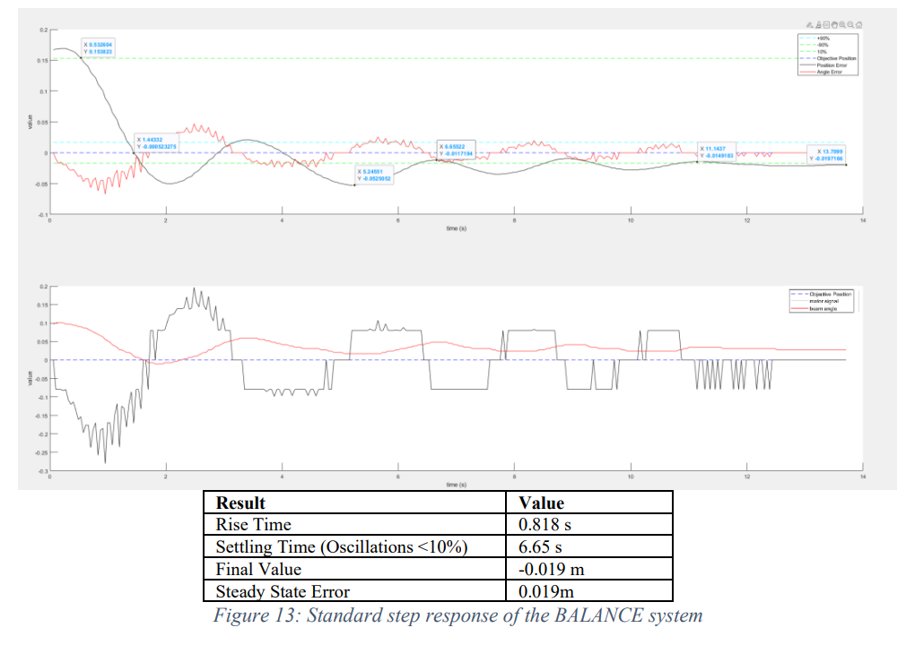

# BALANCE Control System
The complete system is described in detail in the Documentation/ECE490_Completed_Project_BALANCE_FinalReport_MatthewEbert.pdf

The BALANCE system is a visual servoing control system which positions a ball on a ball and beam control system. This implementation uses MATLAB and a Raspberry PI to control and DC motor with a feedback signal from a raspberry pi CAM.
  
  
 

The requirements of the design are
  

The algorithm of the system can be seen below.
 

A standard response of the system was plotted in the figure below
  

